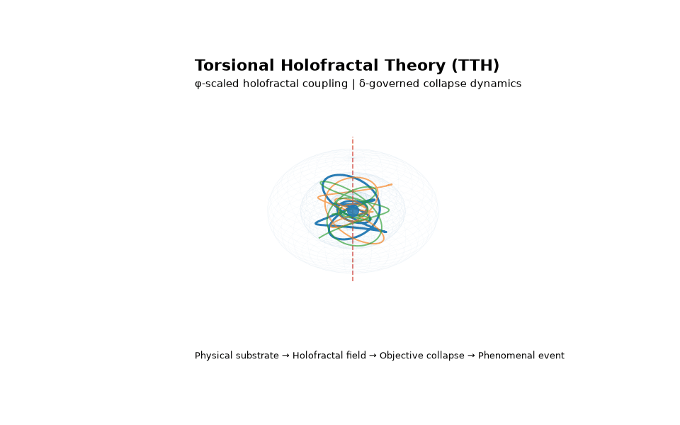
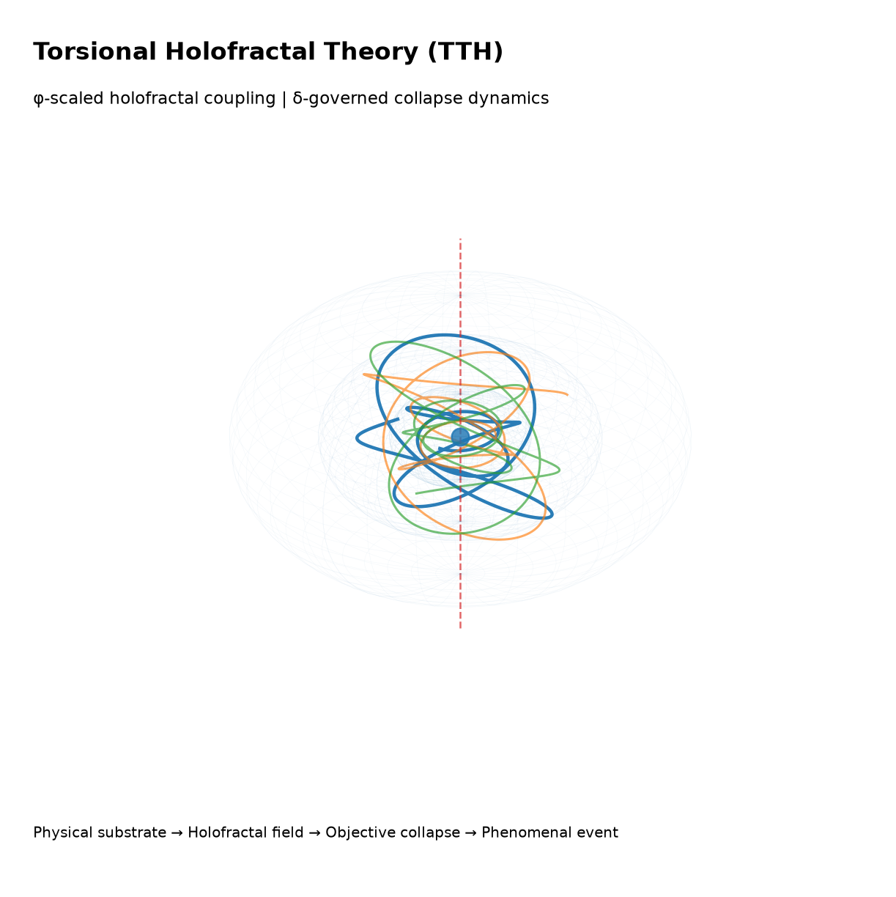

# Torsional Holofractal Theory (TTH)

<div align="center">

**A Geometric Framework for Objective Quantum Collapse,
Integrated Information, and the Physical Basis of Consciousness**

[](mailto:wcalmels@phi47.cl)
[](https://tuch.systems)
[](LICENSE)
[](https://python.org)
[](https://www.latex-project.org/)
[](https://doi.org/10.5281/zenodo.20894792)

<p align="center">
  
</p>

<p align="center">
  <a href="https://wcalmels.github.io/tth-theory/"><b>Landing Page</b></a> ·
  <a href="https://doi.org/10.5281/zenodo.20894792"><b>Repository DOI</b></a> ·
  <a href="https://doi.org/10.5281/zenodo.20897772"><b>Paper 1</b></a> ·
  <a href="https://doi.org/10.5281/zenodo.20932474"><b>Paper 2</b></a>
</p>
*"The universe is a quantum gravitational optimizer, collapsing superpositions
into definite experiences at a rate governed by δ = 4.66920…"*

</div>

---

## Research Outputs

| Output     | Description                                                                                                         | DOI                                                                |
| ---------- | ------------------------------------------------------------------------------------------------------------------- | ------------------------------------------------------------------ |
| Repository | Torsional Holofractal Theory (TTH) research repository                                                              | [10.5281/zenodo.20894792](https://doi.org/10.5281/zenodo.20894792) |
| Paper 1    | Geometric framework for objective quantum collapse, integrated information, and the physical basis of consciousness | [10.5281/zenodo.20897772](https://doi.org/10.5281/zenodo.20897772) |
| Paper 2    | Hierarchical consciousness architecture, neural implementation, and experimental predictions                        | [10.5281/zenodo.20932474](https://doi.org/10.5281/zenodo.20932474) |

---

## Visual Overview

<p align="center">
  
</p>

---

## Overview

**Torsional Holofractal Theory (TTH)** is a mathematically rigorous extension of Einstein–Cartan gravity incorporating a holofractal scalar field φ(x), whose vacuum expectation value is fixed by the **golden ratio**

```text
Φ = (1 + √5) / 2 = 1.61803…
```

and whose potential is modulated by the **Feigenbaum constant**

```text
δ = 4.66920160910299…
```

The theory derives, from a single action principle, three coupled field equations that generate gravitational, quantum, cosmological, and neurophysical predictions.

| Result | Description                                                  | Section |
| ------ | ------------------------------------------------------------ | ------- |
| **R1** | Modified Einstein–Cartan equations with φ²-modulated torsion | §III    |
| **R2** | CMB log-periodic modulations with frequency δ in ln(ℓ)       | §IV     |
| **R3** | Objective quantum collapse when Φ_TTH > ℏ/(δ·M_Pl)           | §V      |
| **R4** | EEG fractal dimension D_f = 2 − (δ−4)/(δ−3) = **1.599**      | §VI     |
| **R5** | Three-level consciousness hierarchy from field equations     | §VI     |

---

## Five Falsifiable Predictions

| #      | Domain         | Prediction                                         | Test                    |
| ------ | -------------- | -------------------------------------------------- | ----------------------- |
| **P1** | Cosmology      | δC_ℓ/C_ℓ ~ 2% sin(δ·ln ℓ)                          | Planck 2018, CMB-S4     |
| **P2** | Quantum optics | Γ_UCN ~ 10⁻⁶ Hz ultra-cold neutron decoherence     | PSI, ILL, SNS           |
| **P3** | Neuroscience   | D_f^EEG = 1.599 during conscious wakefulness       | 256-channel EEG + MFDFA |
| **P4** | Neuroscience   | Φ_IIT ∝ (D_f − 3)²                                 | TMS-EEG + MFDFA         |
| **P5** | Neuroscience   | Schumann resonance at 7.83 Hz entrains D_f and PCI | TMS protocol            |

---

## Repository Structure

```text
tth-theory/
│
├── README.md
├── LICENSE
├── CITATION.cff
│
├── papers/
│   ├── latex/
│   │   ├── paper1.tex
│   │   ├── paper2.tex
│   │   └── cover_letter.tex
│   └── pdf/
│       ├── TTH_Paper1_CalmelsVondemKnesebeck_2026.pdf
│       └── TTH_Paper2_Hierarchy_CalmelsVondemKnesebeck_2026.pdf
│
├── figures/
│   ├── hero/
│   │   └── tth_3d_hero.png
│   ├── gifs/
│   │   └── tth_holofractal_animation.gif
│   ├── scripts/
│   │   ├── figures_1to7.py
│   │   ├── figure8.py
│   │   ├── figure9.py
│   │   └── figure10.py
│   └── output/
│
├── scripts/
│   └── visualization/
│       └── generate_tth_3d.py
│
├── code/
│   ├── simulations/
│   │   ├── tth_field_equations.py
│   │   ├── collapse_dynamics.py
│   │   ├── cmb_oscillations.py
│   │   └── eeg_fractal.py
│   ├── analysis/
│   │   ├── mfdfa.py
│   │   ├── hurst_exponent.py
│   │   └── phi_iit_correlation.py
│   └── validation/
│       ├── test_golden_vacuum.py
│       ├── test_feigenbaum_hurst.py
│       ├── test_collapse_criterion.py
│       └── run_all_tests.py
│
└── docs/
    ├── THEORY.md
    ├── PREDICTIONS.md
    └── CHANGELOG.md
```

---

## Quick Start

### Requirements

```bash
pip install numpy scipy matplotlib pandas astropy
```

### Run All Validations

```bash
cd code/validation
python run_all_tests.py
```

Expected output:

```text
✓ Test 1: Golden Vacuum — φ₀ = 1.61803 · M_Pl [PASS]
✓ Test 2: Feigenbaum–Hurst — H = 0.4009 [PASS]
✓ Test 3: Collapse Criterion — Φ_crit = 2.19×10⁻⁴⁴ J·s [PASS]
✓ Test 4: EEG Fractal Dimension — D_f = 1.5991 [PASS]
✓ Test 5: CMB oscillation frequency — Δln(ℓ) = 0.6731 [PASS]
✓ Test 6: Neural collapse timescale — τ ∈ [10⁻³, 10⁻¹] s [PASS]

6/6 tests passed
```

### Generate Scientific Figures

```bash
cd figures/scripts
python figures_1to7.py
python figure8.py
python figure9.py
python figure10.py
```

### Generate 3D Visualization Assets

```bash
python scripts/visualization/generate_tth_3d.py
```

This generates:

```text
figures/hero/tth_3d_hero.png
figures/gifs/tth_holofractal_animation.gif
```

### Compile Papers

```bash
cd papers/latex
pdflatex paper1.tex && pdflatex paper1.tex
pdflatex paper2.tex && pdflatex paper2.tex
```

---

## Key Equations

### TTH Action

```text
S_TTH = ∫ d⁴x √(-g) [L_EC + L_φ + L_matter + L_int]
```

### Holofractal Potential

```text
V(φ) = (λ/4)(φ² - v²)² + Λ_δ⁴[1 - cos(δ·φ/v)]
```

where:

```text
v = Φ_gold · M_Pl
```

### Modified Einstein Equation

```text
(1 - ξφ²/M_Pl²) G_μν(Γ)
+ ξφ/M_Pl² (∇_μ∇_ν - g_μν□)φ
+ g_μν Λ
= 8πG T_μν
```

### Torsion Equation

```text
T^λ_μν (1 + ξφ²/M_Pl²)
= 8πG S^λ_μν − (α_T/M_Pl³) φ δ^λ_[μ j⁵_ν]
```

### Collapse Criterion

```text
Φ_TTH = ∫ η(t)|Ψ|² S_vN(ρ_r) d³r
       > Φ_crit = ℏ/(δ·M_Pl)
       ≈ 2.2×10⁻⁴⁴ J·s
```

### Feigenbaum–Hurst Theorem

```text
H_TTH = (δ−4)/(δ−3) = 0.669/1.669 = 0.4009

D_f^EEG = 2 − H_TTH = 1.599
```

---

## Physical Constants in TTH

| Constant             | Symbol | Value           | Role                               |
| -------------------- | ------ | --------------- | ---------------------------------- |
| Planck mass          | M_Pl   | 2.176 × 10⁻⁸ kg | Sets vacuum v = Φ·M_Pl             |
| Golden ratio         | Φ_gold | 1.61803398…     | Vacuum φ₀/M_Pl                     |
| Feigenbaum δ         | δ_F    | 4.66920160…     | Φ_crit denominator; V(φ) frequency |
| Collapse threshold   | Φ_crit | 2.2 × 10⁻⁴⁴ J·s | Objective reduction criterion      |
| Non-minimal coupling | ξ      | ~10⁴            | From CMB n_s constraint            |
| Torsion coupling     | α_T    | ~1              | Sets η₀ = α_T·Φ_gold               |
| Feigenbaum scale     | Λ_δ    | ~2.4 meV        | Dark-energy amplitude              |
| EEG Hurst exponent   | H_TTH  | 0.4009          | D_f = 2 − H = 1.599                |

---

## Relation to Existing Theories

```text
          ┌─────────────────────────────────────────────────────┐
          │                  TTH                                │
          │  Derived from: S = ∫d⁴x√(-g)[L_EC + L_φ + ...]       │
          └────────┬──────────────┬──────────────┬─────────────┘
                   │              │              │
          ┌────────▼──────┐ ┌────▼────┐ ┌──────▼──────┐
          │   Orch-OR     │ │   IIT   │ │     GNW     │
          │ (limit ξ→0)   │ │ Φ_IIT = │ │ "ignition"= │
          │ τ~ℏ/E_G match │ │ Φ_TTH/η │ │ φ threshold │
          └───────────────┘ └─────────┘ └─────────────┘
```

---

## Papers

### Paper 1

**Torsional Holofractal Theory: A Geometric Framework for Objective Quantum Collapse, Integrated Information, and the Physical Basis of Consciousness**

* PDF: `papers/pdf/TTH_Paper1_CalmelsVondemKnesebeck_2026.pdf`
* Zenodo DOI: [10.5281/zenodo.20897772](https://doi.org/10.5281/zenodo.20897772)

### Paper 2

**Hierarchical Consciousness Architecture in Torsional Holofractal Theory: Neural Implementation and Experimental Predictions**

* PDF: `papers/pdf/TTH_Paper2_Hierarchy_CalmelsVondemKnesebeck_2026.pdf`
* Zenodo DOI: [10.5281/zenodo.20932474](https://doi.org/10.5281/zenodo.20932474)

---

## Citation

If you use this repository or the associated manuscripts, please cite the relevant DOI.

### Repository

```bibtex
@misc{CalmelsVondemKnesebeck2026TTHRepository,
  author       = {Calmels Von dem Knesebeck, Walter},
  title        = {Torsional Holofractal Theory (TTH)},
  year         = {2026},
  publisher    = {Zenodo},
  doi          = {10.5281/zenodo.20894792},
  url          = {https://doi.org/10.5281/zenodo.20894792}
}
```

### Paper 1

```bibtex
@misc{CalmelsVondemKnesebeck2026TTHPaper1,
  author       = {Calmels Von dem Knesebeck, Walter},
  title        = {Torsional Holofractal Theory: A Geometric Framework for Objective Quantum Collapse, Integrated Information, and the Physical Basis of Consciousness},
  year         = {2026},
  publisher    = {Zenodo},
  doi          = {10.5281/zenodo.20897772},
  url          = {https://doi.org/10.5281/zenodo.20897772}
}
```

### Paper 2

```bibtex
@misc{CalmelsVondemKnesebeck2026TTHPaper2,
  author       = {Calmels Von dem Knesebeck, Walter},
  title        = {Hierarchical Consciousness Architecture in Torsional Holofractal Theory: Neural Implementation and Experimental Predictions},
  year         = {2026},
  publisher    = {Zenodo},
  doi          = {10.5281/zenodo.20932474},
  url          = {https://doi.org/10.5281/zenodo.20932474}
}
```

---

## Author

**Walter Calmels Von dem Knesebeck**
Founder & CTO, TUCH Systems Research Laboratory
Iquique, Chile
📧 [wcalmels@phi47.cl](mailto:wcalmels@phi47.cl)
🐙 [github.com/wcalmels](https://github.com/wcalmels)

---

## License

This work is licensed under the [Creative Commons Attribution 4.0 International License (CC BY 4.0)](LICENSE).

You are free to share and adapt this material for any purpose, provided appropriate credit is given.

---

<div align="center">

*"If confirmed, TTH would establish that consciousness has a geometric basis in torsional spacetime,
and that the golden ratio and Feigenbaum constant are structural constants in a physical theory of mind."*

</div>
